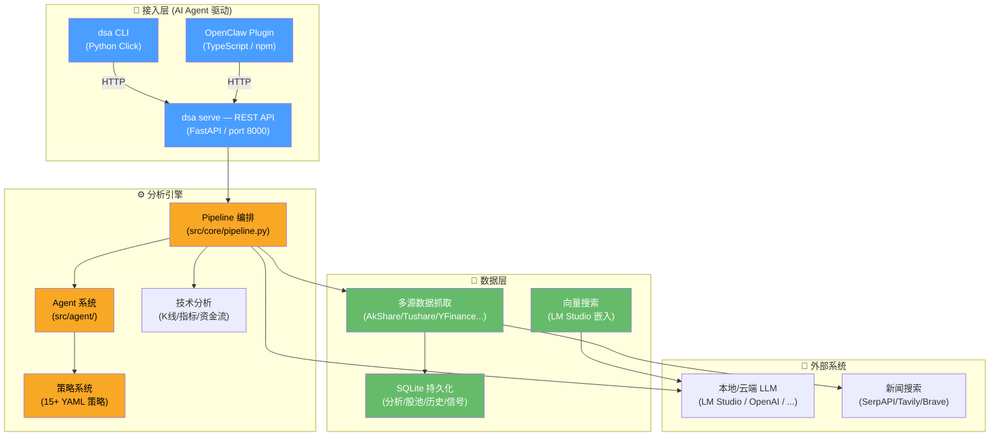

<div align="center">

# 📈 股票智能分析系统

> **Fork 说明**：本项目基于 [ZhuLinsen/daily_stock_analysis](https://github.com/ZhuLinsen/daily_stock_analysis)（MIT License）修改而来。
> 原始项目是一个功能完备的 AI 股票分析平台，包含 Web UI、桌面端、多 Bot 渠道等。
> 本 Fork 的核心变更：
>
> - 🧹 **彻底剥离平台层** — 已移除 Web UI、桌面端、Bot 渠道、通知推送、定时任务（第一阶段）
> - 🤖 **AI Agent 驱动** — 由 AI Agent 通过 CLI / REST API 调用，无自主行为
> - 💻 **本地 LLM 优先** — 默认使用 LM Studio，无需云 API Key
> - 🔌 **保留核心分析引擎** — 多市场数据聚合、AI 决策分析、15+ 策略系统
> - 🏊 **股池 + 向量搜索 + 历史留存** — 轻量级股池管理、语义搜索、会话追踪（第二阶段）

[](https://opensource.org/licenses/MIT)
[](https://www.python.org/downloads/)

</div>

---

## 🏗️ 架构总览



### 发布的包

| 平台 | 包名 | 安装方式 | 说明 |
|------|------|---------|------|
| 🐍 PyPI | `dsa-server` | `pip install dsa-server` | Python 后端（分析引擎 + CLI + API） |
| 📦 npm | `dsa-plugin` | `npm i dsa-plugin` | OpenClaw 原生 Plugin，21 个工具 |
| 📦 npm | `dsa-api-client` | `npm i dsa-api-client` | TypeScript REST API 客户端 |

---

## ✨ 核心能力

| 能力 | 覆盖内容 |
|------|---------|
| AI 决策报告 | 核心结论、评分、趋势、买卖点位、风险警报、催化因素、操作检查清单 |
| 多市场数据聚合 | A股、港股、美股、ETF；行情、K 线、技术指标、资金流、筹码、新闻、公告和基本面 |
| 策略系统 | 均线金叉、缠论、波浪理论、多头趋势、热点题材、事件驱动、成长质量、预期重估等 15+ 策略 |
| Agent 问股 | 多轮追问，策略驱动的分析对话，支持自定义策略 YAML |
| 🏊 **股池管理** | 轻量级自选股分组，标签管理，CLI/API/MCP/Agent 四通道操作 |
| 🔍 **语义搜索** | 自然语言搜索历史分析/新闻/对话，LM Studio 向量化，无需额外模型 |
| 📜 **历史留存** | 分析会话追踪、全文搜索、JSON/CSV 导出、按策略自动清理 |

### 数据来源

| 类型 | 支持 |
|------|------|
| AI 模型 | OpenAI 兼容（DeepSeek、通义千问、Gemini、Claude 等）、Ollama 本地模型 |
| 行情数据 | AkShare、Tushare、Pytdx、Baostock、YFinance、LongBridge、TickFlow |
| 新闻搜索 | SerpAPI、Tavily、Brave、博查、SearXNG |

---

## 🚀 快速开始

### 方式一：pip 安装（无需克隆）

```bash
# 安装后端
pip install dsa-server

# 安装全部依赖（数据源 + LLM + API）
pip install "dsa-server[full]"

# 启动 API 服务
dsa serve

# 另开终端，分析股票
dsa analyze 600519
```

### 方式二：克隆仓库（开发模式）

```bash
git clone https://github.com/kuaizhongqiang/daily_stock_analysis.git && cd daily_stock_analysis
pip install -r requirements.txt
pip install -e .
cp .env.example .env

# 分析
python main.py
```

常用命令：

```bash
python main.py --debug              # 调试模式
python main.py --dry-run            # 干跑
python main.py --stocks 600519,hk00700,AAPL   # 指定股票
python main.py --market-review      # 仅大盘复盘
```

CLI 工具（需 `pip install -e .`）：

```bash
# 股票分析
dsa analyze 600519                  # 分析股票
dsa market                          # 大盘复盘
dsa resolve 茅台                     # 股票名称解析

# 股池管理（第二期）
dsa pool create 我的自选              # 创建股池
dsa pool add 1 600519 --market cn   # 添加股票
dsa pool stocks 1                   # 查看池内股票

# 语义搜索（第二期）
dsa vector search "茅台近期走势"      # 自然语言搜索
dsa vector status                    # 索引状态

# 历史管理（第二期）
dsa history search 茅台              # 全文搜索历史
dsa history export --format json     # 导出历史
dsa history stats                    # 统计信息

# REST API 服务
dsa serve                          # 启动 API 服务（FastAPI / port 8000）
```

### 🎯 OpenClaw Plugin（v0.1 新）

通过原生 TypeScript Plugin 深度集成 OpenClaw：

```bash
# 编译插件
cd extensions/dsa-plugin && pnpm install && pnpm build
```

**21 个结构化工具** — 分析、行情、大盘、股池、搜索、历史、策略问股，全部参数 JSON Schema 校验，内置会话上下文追问、审批流（高危操作需确认）、主动推送（股价预警）。

详见 [DSA Plugin 文档](extensions/dsa-plugin/README.md) 和 [Plugin vs Skill 对比](docs/openclaw-skill-integration.md#plugin-模式)。

---

## ⚙️ 配置说明

完整环境变量、模型渠道、数据源优先级、交易纪律等见 [完整配置指南](docs/full-guide.md)。

关键配置项：

| 环境变量 | 说明 |
|---------|------|
| `STOCK_LIST` | 自选股代码，如 `600519,hk00700,AAPL` |
| `LLM_LM_STUDIO_BASE_URL` | 本地 LM Studio 地址（默认 `http://localhost:1234/v1`） |
| `LITELLM_MODEL` | 本地模型名（默认 `openai/qwen/qwen3.5-9b`） |
| `SERPAPI_API_KEYS` | 新闻搜索 API |
| `TAVILY_API_KEYS` | 新闻搜索 API |

---

## 📄 License

[MIT License](LICENSE)

- Copyright © 2026 **ZhuLinsen**（原始作者）
- Copyright © 2026 **kuaizhongqiang**（Fork 修改）

原始版权声明和许可协议保持完整，详见 [LICENSE](LICENSE)。

## ⚠️ 免责声明

本项目仅供学习和研究使用，不构成任何投资建议。股市有风险，投资需谨慎。
